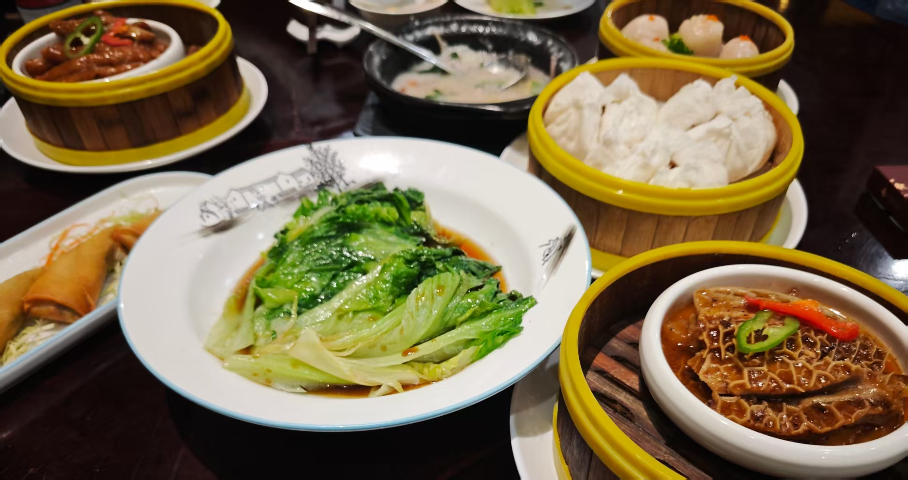
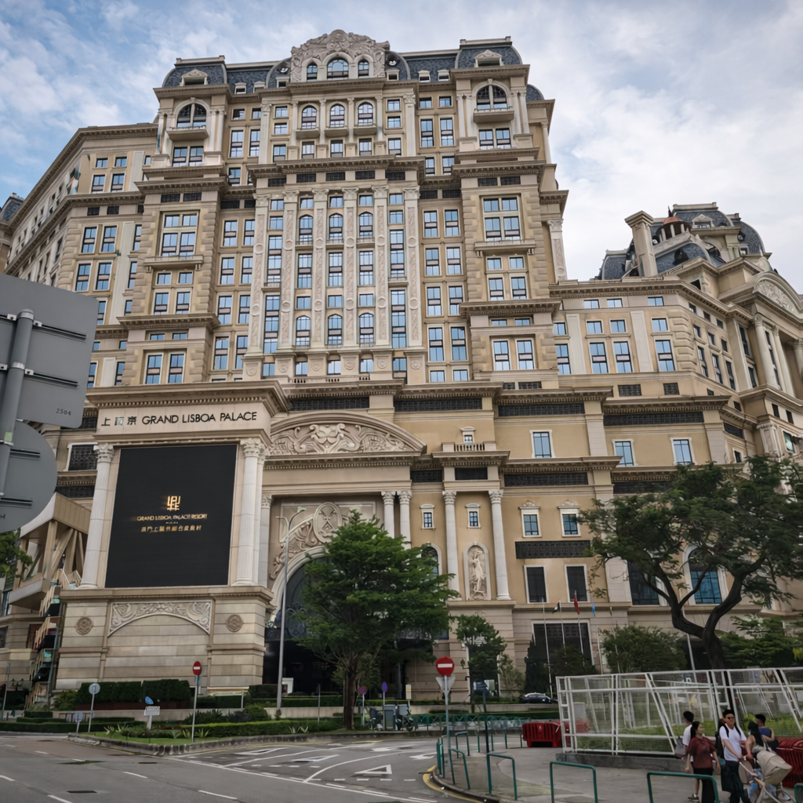
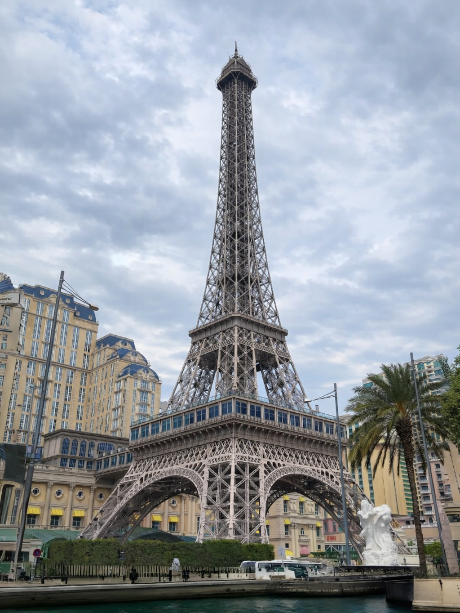
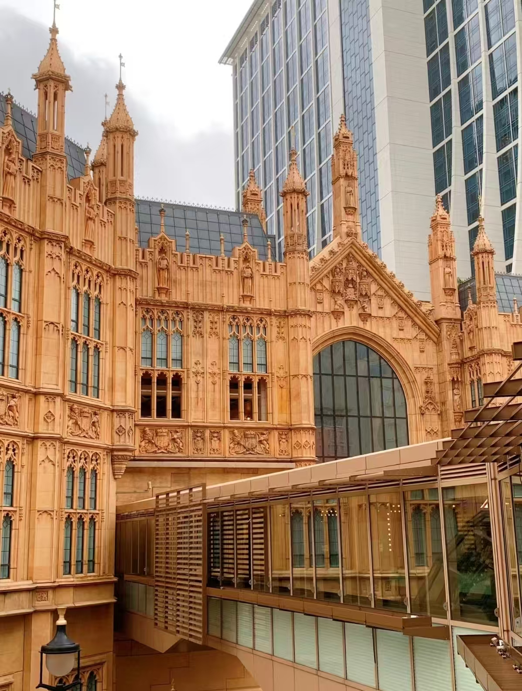
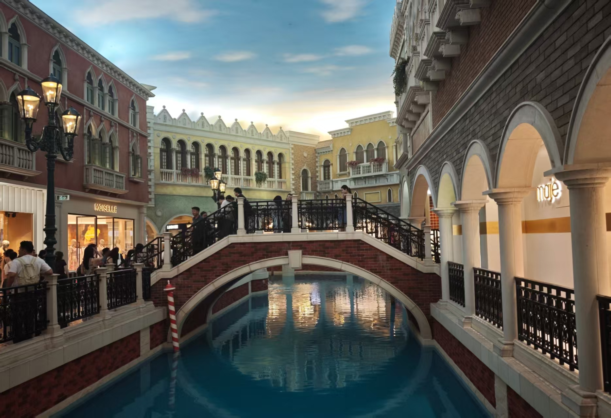
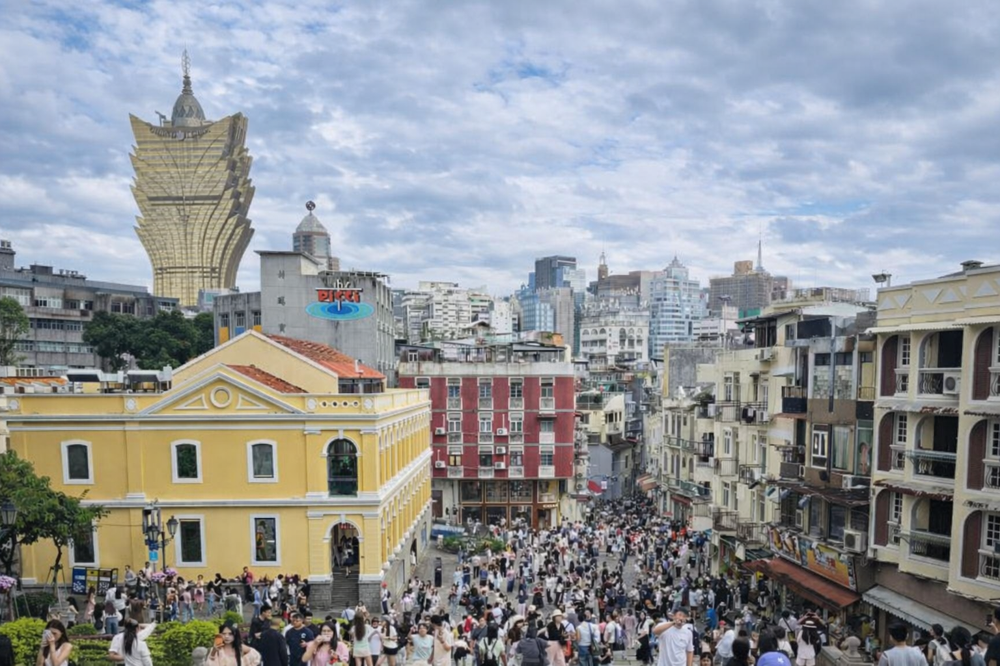

一直盘算着办一张港卡，找机会折腾一下美股，刚好有朋友推荐了澳门蚂蚁银行，于是便挑了个周末，去了一趟澳门。仓促之间很多事情没有提前准备，所幸流程也并不复杂，有机会的话也会把这次办卡的经历整理分享出来。

本次旅行的主要目的：
- [x] 开通蚂蚁银行澳门
- [x] 在澳门吃吃喝喝一天

澳门很小，一天就够完整逛一圈，但它的特质不在于“有多少景点”，而是把不同的气质压缩在一块不大的地方：一边是金光灿灿、极尽铺张的娱乐酒店，一边是教堂、牌坊、石板路、老巷子和带着葡式痕迹的城市表情；一边是游客的喧哗，一边又是本地居民生活那种不急不慢的生活节奏。

## 行程起点：拱北
住在拱北附近，最大的好处就是方便。

早上10:30出发去吃了一顿早茶，广式经典的肠粉、排骨、虾饺，叉烧包，都没有踩雷，白灼生菜也比杭州的任何一家店都好吃，3个人吃了300块钱。

<figure>
  
  <figcaption>银都茶皇殿（粤海东路店）</figcaption>
</figure>

## 半岛闲逛
过关之后，各家赌场和酒店都有自己的免费接驳车，也就是大家常说的“发财车”。原本想去新葡京，一看排队要一个多小时，果断改道去了上葡京，后面再坐发财车联通各个赌场。
在上葡京顺利办完了卡，随后便顺着路一路闲逛，伦敦人、美高梅、巴黎人、威尼斯人。

<figure>
  
  <figcaption>上葡京</figcaption>
</figure>

    <figure>
    
    <figcaption>巴黎人</figcaption>
    </figure>
    <figure>
    
    <figcaption>伦敦人</figcaption>
    </figure>

<figure>
  
  <figcaption>威尼斯人</figcaption>
</figure>

## 大三巴
从南澳打车去大三巴很方便，支付宝就能付钱，25块钱左右。
<figure>
  
  <figcaption>大三巴</figcaption>
</figure>

大三巴牌坊前依旧是人山人海，打了个卡，顺手买了份葡挞。往新葡京方向走走，惊喜地发现了蜜雪冰城。
<figure>
  
  <figcaption>大三巴前</figcaption>
</figure>

## 返程
最后一站回到了新葡京。在大厅里转了转，欣赏了一下各种藏品，在负一层领了票，坐上回拱北的发财车，随后打车奔向机场。

